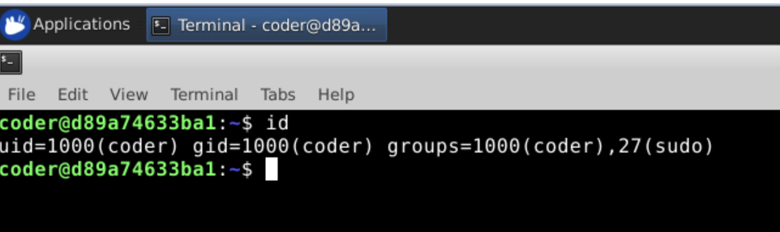
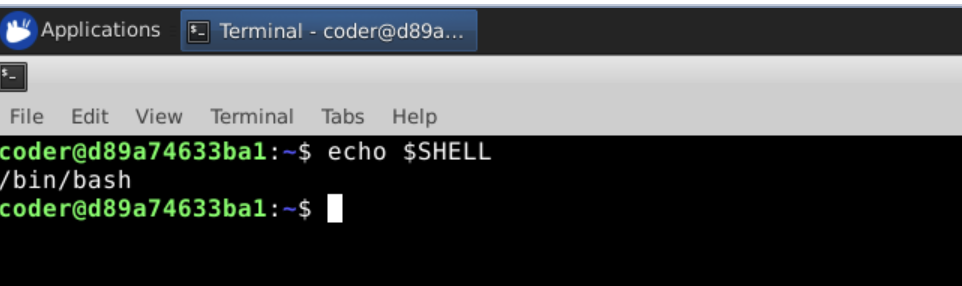
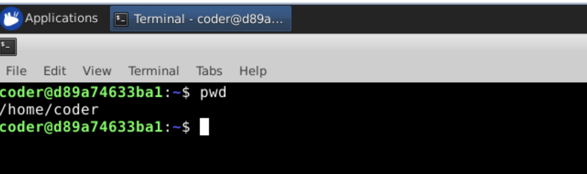
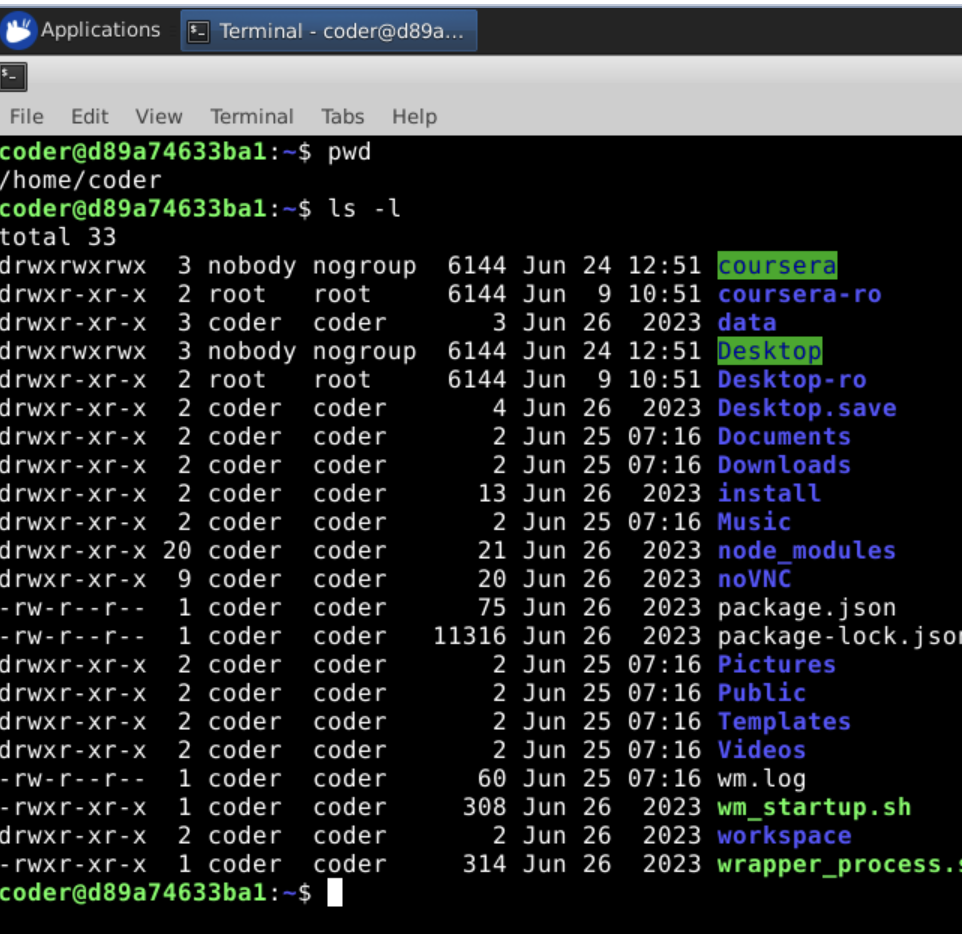
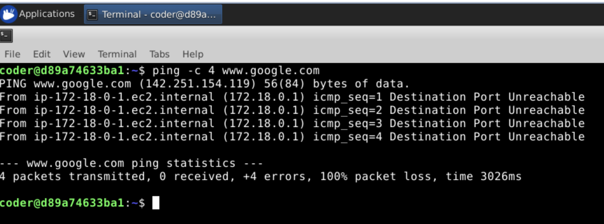

1. User and Group Verification

Command Used: id  

Output: uid=1000(coder) gid=1000(coder) groups=1000(coder),27(sudo)  

Explanation: I used the "id" command to get details about the username and id, the groups I belong to.

Screenshot: 

----------------------------------------------------------------------------------------------------------------------------------------------------------------------------
    
2. Current Shell

a) Command used: echo $SHELL  

Ouput: /bin/bash

Explanation: I used the echo $SHELL command to display the current shell being used. The $SHELL variable is an environment variable that stores the path to the user's default login shell, and the echo command prints the value of that variable to the terminal.

Screenshot:   

----------------------------------------------------------------------------------------------------------------------------------------------------------------------------    

3. Current Working Directory

Commands used: pwd

Ouput: /home/coder

Explanation: I used the pwd command to display the current working directory. The command stands for "print working directory" and shows the absolute path from the root directory to my present location in the filesystem.

Screenshot:   

----------------------------------------------------------------------------------------------------------------------------------------------------------------------------

4. List of files and working directories

Command used: ls -l

Output: A list of files and folders were generated.

Explanation: I used the ls -l command to list the files in the present directory. While ls is used to list files, the -l option lists more details about it, such as permissions, ownership, and modification timestamps.  

Screenshot:   

----------------------------------------------------------------------------------------------------------------------------------------------------------------------------

5. Network connectivity verification result

Command used: ping -c 4 www.google.com  

Ouput Screenshot:   

Explanation: I used the ping to send packets to google.com. Since it would continuously send pings, I used the -c option to limit the number of pings to 4.  

