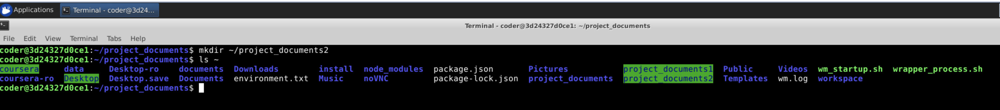

1. Project Workspace Setup

Command Used: mkdir ~/documents  

Output Screenshot: 

Explanation: I used the "mkdir" command to create the documents directory. I used the path ~ to create it in the home directory.  

----------------------------------------------------------------------------------------------------------------------------------------------------------------------------
